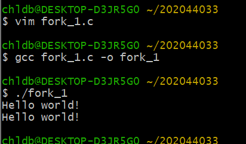
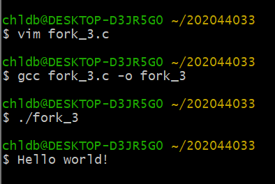
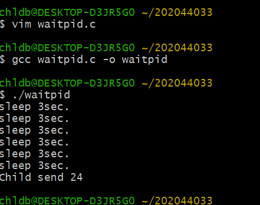

fork
</img>
fork_1
</img>
fork_2
</img>
 fork_3
</img>
fork_4
</img>
 zombie
</img>
remove_zombie
</img>
 wait
</img>
waitpid
</img>
 signal
</img>
sigaction
</img>
 file_serverclient
</img>
socket_gethostbyname
</img>
